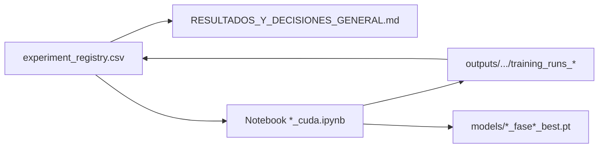

# Mejoras cascada V3 — índice (`notebooks/v3_local/mejoras/`)

Plan de experimentos secuenciales sobre el pipeline **cascada binario → multiclase core** (`train_spine_cascade_binary_to_thoracolumbar_v3.ipynb`). Cada fase tiene carpeta propia, notebook(s), CSV de métricas, decisión documentada y enlace al registro central.

**Estado del plan (fases 1–8):** cerrado. **Pipeline adoptado:** Fase 3 (LR multiclase ×0,5 + `CosineAnnealingLR`) + Fase 4 (augmentación geométrica suave en ROI de entrenamiento), integrado en el notebook vivo.

---

## Notebook final y mejor run de referencia (cierre del plan)

| Qué | Ruta / identificador |
|-----|----------------------|
| **Notebook oficial (el que se deja como final)** | [`notebooks/v3_local/train_spine_cascade_binary_to_thoracolumbar_v3.ipynb`](../train_spine_cascade_binary_to_thoracolumbar_v3.ipynb) |
| **Contenido** | Misma lógica que **Fase 3 + Fase 4** integrada (LR ×0,5 + `CosineAnnealingLR`, augment ROI en train multiclase, etc.). Es el único artefacto de entrenamiento que debe considerarse **procedimiento vigente** tras cerrar las mejoras. |
| **Mejor corrida experimentada *adoptada* en el plan** | ID **`4_cuda`** (Fase 4) — `macro_dice_fg` test **0,2380**, `macro_iou_fg` **0,1415** (seed 42). |
| **Notebook de esa corrida (evidencia / Colab)** | [`train_spine_cascade_binary_to_thoracolumbar_v3_mejorafase4_augmentacion_roi/train_spine_cascade_binary_to_thoracolumbar_v3_mejorafase4_augmentacion_roi_cuda.ipynb`](train_spine_cascade_binary_to_thoracolumbar_v3_mejorafase4_augmentacion_roi/train_spine_cascade_binary_to_thoracolumbar_v3_mejorafase4_augmentacion_roi_cuda.ipynb) |
| **Métricas y pesos del run `4_cuda`** | `outputs/analysis_outputs_v3/training_runs_cascade_v3_fase4_augment_roi_cuda/` · `models/binary_spine_cascade_fase4_augment_roi_cuda_best.pt` y `models/thoracolumbar_core_cascade_fase4_augment_roi_cuda_best.pt` |

**Nota:** entre todos los runs registrados, la **macro test más alta** fue **`5_cuda_s1337`** (0,2457), pero la decisión fue **«prometedor; no consolidado»** (alta varianza entre semillas). Por eso el **criterio de producto** sigue el pipeline **F3+F4** materializado en el notebook vivo y la referencia métrica **`4_cuda`**, no la semilla 1337.

*(Comparativa numérica Baseline / notebook final / mejor run: [Referencias métricas](#referencias-métricas) más abajo.)*

---

## Por dónde empezar

| Si necesitas… | Abre |
|---------------|------|
| Decisión y métricas de un vistazo | [RESULTADOS_Y_DECISIONES_GENERAL.md](RESULTADOS_Y_DECISIONES_GENERAL.md) → [Resumen final](RESULTADOS_Y_DECISIONES_GENERAL.md#resumen-final--registro-de-experimentos) |
| Filtrar / exportar experimentos | [experiment_registry.csv](experiment_registry.csv) |
| Criterios de adopción y glosario | [PLAN_ACCION_AJUSTES_MODELOS.md](PLAN_ACCION_AJUSTES_MODELOS.md) |
| Regenerar notebooks o cerrar un run | [scripts/README_MEJORAS_CASCADE.md](scripts/README_MEJORAS_CASCADE.md) |
| Detalle de una fase concreta | Tabla [Mapa de fases](#mapa-de-fases) → `README.md` de la carpeta |

---

## Referencias métricas

### Baseline vs notebook final vs mejor run (test)

| | ID | `macro_dice_fg` | `macro_iou_fg` | Δ vs baseline (dice / IoU) | Nota |
|---|-----|-----------------|----------------|----------------------------|------|
| **Baseline** | `0` | **0,1894** | **0,1126** | — | Referencia sin mejoras de fases. |
| **Notebook final** (F3+F4 integrado) | ref. **`4_cuda`** | **0,2380** | **0,1415** | +0,0486 / +0,0289 | [`train_spine_cascade_binary_to_thoracolumbar_v3.ipynb`](../train_spine_cascade_binary_to_thoracolumbar_v3.ipynb). |
| **Mejor run** (máximo macro entre runs ejecutados) | **`5_cuda_s1337`** | **0,2457** | **0,1503** | +0,0563 / +0,0377 | No adoptado como oficial (varianza multiseed); ver nota arriba. |

*En `RESULTADOS_Y_DECISIONES_GENERAL.md`, la misma comparativa se genera al ejecutar `python notebooks/v3_local/mejoras/scripts/sync_registry_to_resultados.py` (valores tomados del CSV).*

### Resumen por rol (detalle en CSV)

| Rol | ID / run | `macro_dice_fg` (test) | `macro_iou_fg` (test) | Carpeta métricas |
|-----|----------|------------------------|------------------------|------------------|
| **Baseline** | `0` | **0,1894** | **0,1126** | `outputs/analysis_outputs_v3/training_runs_cascade_v3/` |
| **Pipeline adoptado** | `4_cuda` | **0,2380** | **0,1415** | `outputs/analysis_outputs_v3/training_runs_cascade_v3_fase4_augment_roi_cuda/` |

Notebook de producción local: [`../train_spine_cascade_binary_to_thoracolumbar_v3.ipynb`](../train_spine_cascade_binary_to_thoracolumbar_v3.ipynb).

---

## Trazabilidad (cadena recomendada)



1. **`experiment_registry.csv`** — una fila por experimento: `id`, `fase`, `fecha`, `hipotesis`, `output_metricas`, `macro_dice_fg_test`, `decision`, `notas`.
2. **`RESULTADOS_Y_DECISIONES_GENERAL.md`** — narrativa por fase, tabla §7.2 acumulativa y **Resumen final** (solo runs con `fecha`; columnas Δ vs baseline).
3. **Carpeta `train_*_mejorafaseN_*`** — README de fase + notebook(s) `_cpu` / `_cuda` con celdas «Análisis e interpretación».
4. **`outputs/analysis_outputs_v3/training_runs_cascade_v3_fase*`** — CSV (`*_test_metrics.csv`, `*_per_class_metrics.csv`, historiales, splits).
5. **`models/`** — checkpoints con nombre `*_fase<N>_…_cuda_best.pt` (misma convención que el notebook de la fase).

Tras editar el CSV:

```bash
python notebooks/v3_local/mejoras/scripts/sync_registry_to_resultados.py
```

---

## Documentos en esta carpeta

| Archivo | Función |
|---------|---------|
| [README.md](README.md) | Este índice |
| [PLAN_ACCION_AJUSTES_MODELOS.md](PLAN_ACCION_AJUSTES_MODELOS.md) | Roadmap, convenciones §0, criterios por fase, plantillas §7 |
| [RESULTADOS_Y_DECISIONES_GENERAL.md](RESULTADOS_Y_DECISIONES_GENERAL.md) | Historial, fichas §7.1, tabla §7.2, resumen ejecutivo |
| [experiment_registry.csv](experiment_registry.csv) | Fuente tabular; sincroniza el resumen final |
| [scripts/](scripts/) | `build_fase*`, `patch_fase*`, módulo común, `sync_registry_to_resultados.py` |

---

## Mapa de fases

Rutas relativas a la **raíz del repo**. Runs de decisión: variantes **`_cuda`** (Colab/GPU). Variantes **`_cpu`** son opcionales (perfil liviano local).

| Fase | ID(s) principal(es) | Carpeta | Notebook CUDA (referencia) | Salida métricas | Decisión |
|------|---------------------|---------|----------------------------|-----------------|----------|
| 0 | `0` | [mejorafase0_base](train_spine_cascade_binary_to_thoracolumbar_v3_mejorafase0_base/) | [baseline](train_spine_cascade_binary_to_thoracolumbar_v3_mejorafase0_base/train_spine_cascade_binary_to_thoracolumbar_v3_baseline.ipynb) / [vivo](../train_spine_cascade_binary_to_thoracolumbar_v3.ipynb) | `training_runs_cascade_v3/` | N/A baseline |
| 1 | `1_cuda` | [mejorafase1_letterbox_roi](train_spine_cascade_binary_to_thoracolumbar_v3_mejorafase1_letterbox_roi/) | `…_letterbox_roi_cuda.ipynb` | `…_fase1_letterbox_cuda/` | No adoptar |
| 2 | `2_cuda` | [mejorafase2_pesos_clases_t7_t12](train_spine_cascade_binary_to_thoracolumbar_v3_mejorafase2_pesos_clases_t7_t12/) | `…_pesos_clases_t7_t12_cuda.ipynb` | `…_fase2_pesos_t7_t12_cuda/` | No adoptar |
| 3 | `3_cuda`, `3_cuda_repro_b` | [mejorafase3_scheduler_lr](train_spine_cascade_binary_to_thoracolumbar_v3_mejorafase3_scheduler_lr/) | `…_scheduler_lr_cuda.ipynb`, `…_cuda_repro_verificacion.ipynb` | `…_fase3_scheduler_lr_cuda/`, `…_cuda_repro_b/` | **Adoptar** (F3 en vivo) |
| 4 | `4_cuda` | [mejorafase4_augmentacion_roi](train_spine_cascade_binary_to_thoracolumbar_v3_mejorafase4_augmentacion_roi/) | `…_augmentacion_roi_cuda.ipynb` | `…_fase4_augment_roi_cuda/` | **Adoptar** (F4 en vivo) |
| 5 | `5_cuda_s42`, `5_cuda_s1337`, `5_cuda_s4242` | [mejorafase5_multiseed](train_spine_cascade_binary_to_thoracolumbar_v3_mejorafase5_multiseed/) | tres `…_multiseed_cuda_seed*.ipynb` | `…_fase5_multiseed_cuda_s*/` | Prometedor; no consolidado |
| 6 | `6_cuda` | [mejorafase6_postproceso_ligero](train_spine_cascade_binary_to_thoracolumbar_v3_mejorafase6_postproceso_ligero/) | `…_postproceso_ligero_cuda.ipynb` | `…_fase6_postproc_cuda/` | No adoptar |
| 7 | `7_cuda` | [mejorafase7_auxiliares_rango_lastvis](train_spine_cascade_binary_to_thoracolumbar_v3_mejorafase7_auxiliares_rango_lastvis/) | `…_auxiliares_rango_lastvis_cuda.ipynb` | `…_fase7_lastvis_cuda/` + `training_runs_last_visible_fase7_cuda/` | No adoptar |
| 8 | `8_cuda` | [mejorafase8_eficiencia](train_spine_cascade_binary_to_thoracolumbar_v3_mejorafase8_eficiencia/) | `…_eficiencia_cuda.ipynb` | `…_fase8_eficiencia_cuda/` | No adoptar |

Checkpoints por fase ejecutada: `models/binary_spine_cascade_fase<N>_…_best.pt` y `models/thoracolumbar_core_cascade_fase<N>_…_best.pt` (Fase 7 además `models/last_visible_estimator_fase7_lastvis_cuda_best.pt`).

---

## Rutas canónicas (raíz del repo)

| Recurso | Ruta |
|---------|------|
| Dataset (no versionado) | `data/Scoliosis_Dataset/` |
| Métricas V3 | `outputs/analysis_outputs_v3/` |
| Pesos | `models/` |
| Notebook cascada vivo | `notebooks/v3_local/train_spine_cascade_binary_to_thoracolumbar_v3.ipynb` |
| Inspección ROI | `notebooks/v3_local/train_spine_cascade_binary_to_thoracolumbar_v3_inspection_ROI.ipynb` |

En Colab: usar el notebook **`_cuda`** de la fase, `%cd` a la raíz del clon o variable `MAIA_PROJECT_ROOT` antes de imports (ver plan §0 y [scripts/README_MEJORAS_CASCADE.md](scripts/README_MEJORAS_CASCADE.md)).

---

## Flujo operativo (nueva fase o re-cierre)

1. Definir hipótesis y criterio en [PLAN_ACCION_AJUSTES_MODELOS.md](PLAN_ACCION_AJUSTES_MODELOS.md).
2. Generar notebooks: `python notebooks/v3_local/mejoras/scripts/build_faseN_….py`.
3. Ejecutar **`_cuda`** → comprobar CSV en `output_metricas` del registro.
4. Completar análisis en el notebook o `patch_faseN_*_analysis_cells.py`.
5. Actualizar [experiment_registry.csv](experiment_registry.csv) y ejecutar `sync_registry_to_resultados.py`.
6. Añadir sección en [RESULTADOS_Y_DECISIONES_GENERAL.md](RESULTADOS_Y_DECISIONES_GENERAL.md) y fila en tabla §7.2.
7. Si **Adoptar**: integrar cambios en `train_spine_cascade_binary_to_thoracolumbar_v3.ipynb` y documentar en README de la fase.

**Reglas:** no sobrescribir `training_runs_cascade_v3/` (baseline); no copiar celdas de cierre entre semillas ni entre `_cpu` y `_cuda`; no mover `data/` ni consumibles históricos.

---

## Convención de nombres

| Elemento | Patrón |
|----------|--------|
| Carpeta de fase | `train_spine_cascade_binary_to_thoracolumbar_v3_mejorafase<N>_<descripcion>/` |
| Salida de métricas | `outputs/analysis_outputs_v3/training_runs_cascade_v3_fase<N>_<slug>_{cpu\|cuda}/` |
| ID en CSV | `<N>_cuda`, `3_cuda_repro_b`, `5_cuda_s1337`, etc. |
| Checkpoint | `models/{binary_spine,thoracolumbar_core}_cascade_fase<N>_…_best.pt` |

---

## Relación con el resto del proyecto

Los notebooks numerados `01`–`07` en `notebooks/` documentan la evolución global (cobertura, cascada explicada, estimadores auxiliares). **Esta carpeta** concentra el plan de **mejoras controladas** sobre la cascada V3 local: mismo dataset y mismas métricas comparables, con registro explícito de adopción.

Para clonar y revisar solo el historial de mejoras: empezar por este README → `experiment_registry.csv` → Resumen final en RESULTADOS.
